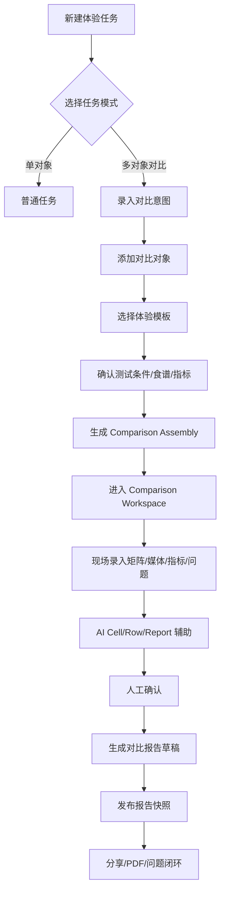
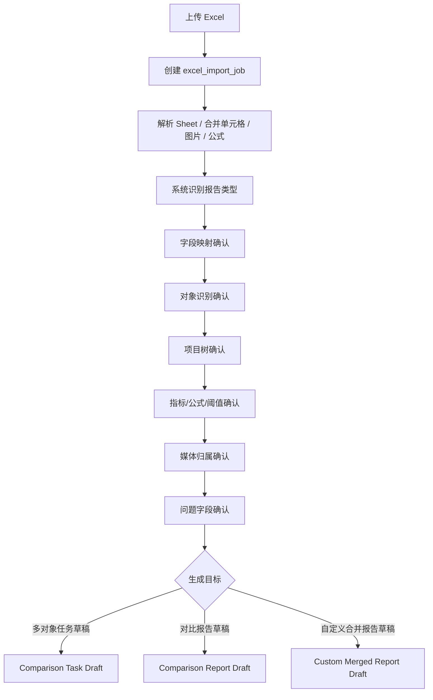
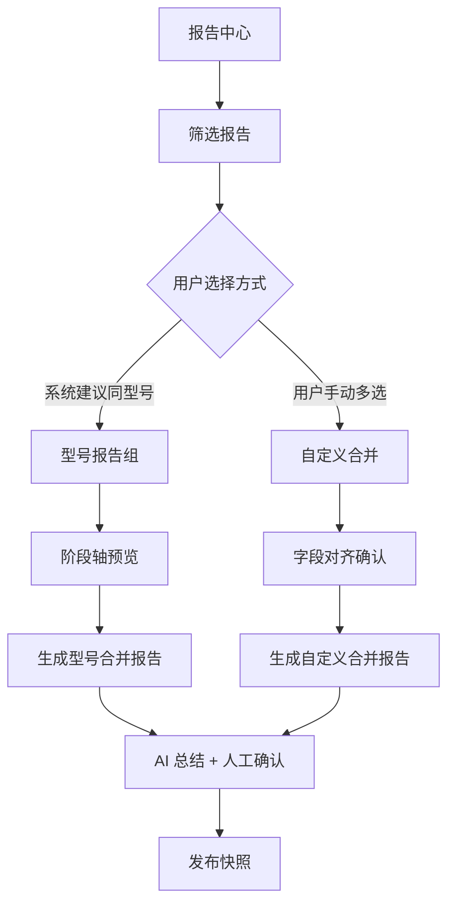
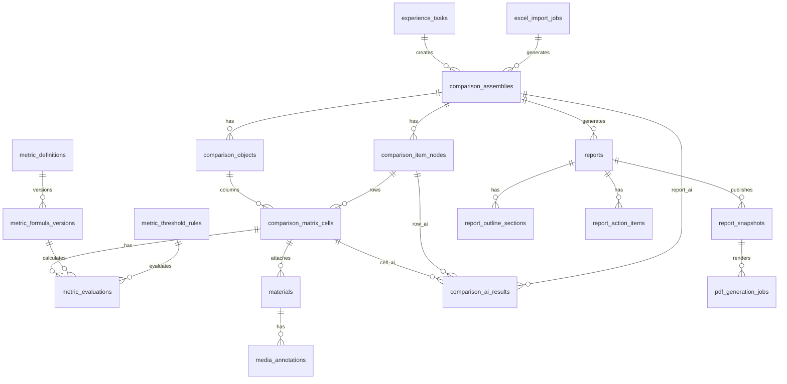

# 产品体验管理平台 PRD V2.5  
## 统一报告体系、多对象对比体验工作台与报告中心秩序化视图（V2.4/V2.5 合并版）

> 版本：V2.5 Merged Full PRD / Report Center Ordered View  
> 日期：2026-06-22  
> 适用平台：产品体验管理平台 V1.0 兼容升级  
> 本版定位：合并 V2.4 “统一报告体系与多对象对比体验工作台”和 V2.5 “报告中心秩序化视图”，重点回应业务反馈“报告中心呈现凌乱、不如 Excel 有序且目标明确”“分页式报告不适配业务阅读”“图片跳转附录不直观”，补齐**报告中心秩序化视图、业务对象就地证据位、报告详情阅读结构、资产聚合方式、前端组件、数据字段、API、QA 验收与实施计划**。  
> 重要约束：本版**不新增一级“对比中心”**；不重写既有“两报告 AI 对比模型”，仅保留为历史沉淀能力与补充入口。

---

# 0. 修订摘要

## 0.1 本版新增内容

| 模块 | 本版更新 |
|---|---|
| 案例集 | 新增 NN/g、Baymard、Material Design、IBM Carbon、Airtable、Notion、Smartsheet、RTINGS 等案例启发，并转译为平台能力 |
| 报告模式 | 明确区分计划内多对象对比、同任务多变体对比、指标型对比、图片证据型对比、型号阶段合并、自定义历史合并、旧版两报告 AI 对比 |
| 录入路径 | 新增“任务创建进入”“Excel 导入进入”“报告中心合并进入”“移动端现场采集进入”四条路径 |
| 多视图体系 | 明确同一数据资产支持矩阵视图、指标视图、图库视图、问题视图、阶段轴视图、报告预览视图 |
| Excel 导入 | 从“导入文件”升级为“上传-解析-映射-校验-生成草稿”的结构化迁移流程 |
| 媒体与图片 | 明确图片按业务对象就地呈现：问题点、食谱步骤、效果评价、对比单元格、整改复评估均有固定证据位；完整归档区只做审计和补充查看，不作为主阅读跳转依赖 |
| AI 审核 | 明确 Cell / Row / Report 三层 AI 的状态机、确认边界、人工修改规则与发布冻结规则 |
| PDF | 明确 Web 业务阅读态与 PDF 交付态分离；PDF 不是网页截图，也不是主阅读模型，必须保持证据随业务对象就地呈现 |
| 报告中心秩序化 | 新增“资产首页—聚合视图—报告详情—交付预览”四层结构，将 Excel 的标题、Sheet、冻结行列、分组表头、颜色区块和小结区转译为 Web 信息架构 |
| 技术视角 | 补齐核心数据表、服务、API、异步任务、Docker 测试环境建议 |
| QA 视角 | 补齐 Golden Test、端到端链路、异常场景、兼容性、性能与权限验收标准 |

## 0.2 V2.3 核心决策保持不变

1. 不新增一级“对比中心”。
2. 对比能力嵌入“体验计划 + 报告中心”两个主入口。
3. 底层使用 `comparison_assembly` 作为组装能力。
4. 所有报告仍统一进入 `reports` 表，通过 `report_type` 区分四类报告资产。
5. Excel 导入、媒体规则、AI 确认、服务端 PDF、报告快照继续作为核心能力。
6. 旧版两报告 AI 对比模型保留，但不作为本轮主要升级对象。

---

# 1. 背景与问题定义

## 1.1 业务背景

产品体验团队目前使用 Excel 承载大量体验报告。历史报告已经能覆盖产品工程工作中的关键内容，例如：

- 体验任务基础信息：品类、型号、阶段、时间、组织人、体验目的、体验场景。
- 问题闭环信息：问题层面、问题出现节点、图片、问题描述、问题等级、改善建议、整改方案、责任部门、责任人、关闭状态。
- 食物效果信息：食谱、时间、效果图片、小结、指标计算、阈值要求。
- 多对象横向比较：同一食谱或同一测试项目下，不同型号、不同口径、不同阶段的横向差异。
- 阶段演进：同一型号从前期研究、试制、试产到量产阶段的问题变化与效果变化。

但 Excel 已经暴露出结构性问题：

| 问题 | 表现 | 影响 |
|---|---|---|
| 录入与呈现混在一起 | 一张 sheet 同时承担数据录入、图片展示、公式计算、报告排版 | 后续复用、合并、AI 分析困难 |
| 图片不可控 | WPS 图片函数、浮动图片、合并单元格混用 | 导入、PDF、跨端展示不稳定 |
| 对比模式混乱 | 单对象报告、双对象指标表、多对象图片矩阵、阶段演进报告混在同一模板体系 | 系统难以判断可比性与报告类型 |
| 公式不可沉淀 | 出汁率、纯汁率、含渣率等公式只在 Excel 单元格内存在 | 无法形成可复用指标模型 |
| 历史报告可比性弱 | 不同阶段、不同项目目的、不同测试条件被人工放在一起看 | 容易产生“强行排序”的错误结论 |
| AI 结果缺少发布闸门 | 若 AI 直接进入报告，会影响交付可信度 | 必须引入人工确认机制 |
| PDF 不可控 | 网页横向滚动和打印版式天然冲突 | 需要服务端 PDF Profile 与预检 |
| 报告中心呈现凌乱 | 当前报告中心若只以卡片或列表堆叠报告，会把普通报告、对比报告、型号合并、问题闭环、图片证据、PDF 交付入口混在同一层 | 业务难以快速判断“这份报告要解决什么问题、当前状态是什么、下一步应该做什么” |

## 1.3 报告中心视图问题与 Excel 秩序拆解

业务反馈“平台报告中心不如 Excel 有序”，并不意味着要把 Excel 画布原样搬到网页，而是说明当前报告中心缺少 Excel 中隐含的阅读秩序。Excel 之所以看起来清晰，主要依赖以下结构：

| Excel 中的秩序来源 | 业务感知价值 | 平台应转译为 | 不应复刻为 |
|---|---|---|---|
| Sheet 标签 | 不同模块天然分开，用户知道自己在看“问题页 / 食物效果页 / 阶段页” | 报告详情内的模块 Tab 与左侧目录 | 多个无层级的页面入口 |
| 顶部标题与小结 | 先看到报告目的和核心结论 | 报告 Header + 结论摘要条 + 下一步行动 | 把结论藏在长正文底部 |
| 冻结行 / 冻结列 | 横向看对象、纵向看项目时不丢上下文 | Sticky 对象头、Sticky 项目列、当前位置面包屑 | 无限横滚且无固定信息 |
| 深色分组表头 | 中式面团、西式面团、问题闭环等模块边界清楚 | 分组标题行、章节锚点、分组统计 | 所有内容平铺卡片 |
| 颜色区块 | 快速区分对象、阶段、异常或状态 | 低饱和状态带、对象色标、风险标签 | 大面积装饰色 |
| 表格行列 | 字段关系稳定，可快速扫读 | 结构化表格 / 对比矩阵 / 问题清单 | 自由布局组件堆叠 |
| 公式列 | 指标结果可信，有计算依据 | 指标定义、公式版本、阈值说明 | 截图式展示公式结果 |
| 空白区 | 手动排版缓冲 | Web 中应移除，用折叠、展开层、证据条和模块锚点替代 | 大面积空白画布 |

平台优化原则：**吸收 Excel 的秩序，不复制 Excel 的画布；报告中心负责“找报告、看状态、进详情、做交付”，报告详情负责“按业务目标阅读”，对比工作台负责“结构化录入与横向比较”。**

## 1.2 产品目标

建设一个面向产品工程师、体验工程师、设计师、研发与项目管理者的“产品体验工程工作台”，将历史 Excel 报告中的有效表达升级为可录入、可计算、可对比、可审核、可发布、可追溯的平台能力。

核心目标：

1. **现场可录**：产品工程师能够在体验现场按模板录入图片、视频、指标、问题与建议。
2. **横向可比**：同一测试条件下，多对象、多变体、多阶段能够形成可扫读的对比矩阵。
3. **指标可算**：出汁率、纯汁率、含渣率、成团时间、出膜等级等指标能够结构化沉淀。
4. **图片直观可控**：图片和视频必须跟随对应业务对象就地展示，问题点、食谱步骤、效果评价、对比单元格、整改复评估均有固定证据位；完整证据归档只用于审计、下载和补充查看，不承担正文理解。
5. **问题可闭环**：体验问题能进入责任、整改、验证、关闭流程。
6. **报告可交付**：报告支持网页、分享页、PDF，并按报告类型自动适配版式。
7. **AI 可辅助但不越权**：AI 负责评价、对比、总结，但必须经人工确认后进入发布资产。
8. **历史可迁移**：既有 Excel 报告可通过字段映射迁移为结构化资产。
9. **模型可沉淀**：报告对比模型、指标模型、模板模型、AI Skill 模型均可逐步复用。

---

# 2. 用户角色与核心场景

## 2.1 用户角色

| 角色 | 核心诉求 | 平台价值 |
|---|---|---|
| 产品体验工程师 | 快速录入体验过程、问题、图片、指标，输出报告 | 减少 Excel 排版时间，提高交付稳定性 |
| 产品工程师 / PM | 查看产品在不同阶段、不同对象、不同功能下的表现差异 | 快速定位体验短板和改进优先级 |
| 研发工程师 | 明确问题现象、证据图片、建议、责任与关闭要求 | 降低沟通成本，支撑整改闭环 |
| 工业设计师 | 理解实际体验问题与设计细节对用户感受的影响 | 参与体验共创与产品优化 |
| 体验负责人 | 查看项目进展、问题分布、报告资产与阶段演进 | 统筹体验工作质量与沉淀 |
| 管理员 | 管理模板、指标、权限、AI Skill、PDF Profile | 确保平台长期稳定运营 |

## 2.2 典型业务场景

| 场景 | 示例 | 推荐模式 |
|---|---|---|
| 单对象体验报告 | 某型号试制阶段体验问题列表 | `single_report` |
| 同一主机多变体对比 | 120mm / 160mm 原汁机口径对比 | `comparison_report` + 指标表型 |
| 三型号横向对比 | 三台 7L 和面机食物效果对比 | `comparison_report` + 图片矩阵型 |
| 同型号阶段演进 | 球形桶和面机前期研究、试制、试产 | `model_merged_report` |
| 多份历史报告合并 | 用户手动选择多份报告形成专题总结 | `custom_merged_report` |
| 旧版两报告 AI 对比 | 历史功能保留，仅做文本差异摘要 | legacy report compare，暂不升级 |

---

# 3. 外部案例集启发

> 说明：本节仅吸收案例的“交互路径、呈现逻辑、信息结构与设计原则”，不复制外部产品视觉。截图如需进入设计稿，应仅作为内部参考，不进入平台产品页面或对外交付材料。

## 3.1 案例集总览

| 案例 | 官方路径 / 参考位置 | 关键启发 | 转译为平台能力 |
|---|---|---|---|
| NN/g Comparison Tables | 文章：Comparison Tables for Products, Services, and Features | 对比表常用“列为产品、行为属性”，便于快速比较 | 对比矩阵基础结构固定为“对象列 × 项目行” |
| Baymard Comparison Tool | 文章：4 Ways to Optimize the Comparison Feature for Scanning | 隐藏相同项、属性分组、滚动时固定列头、横向行样式 | 新增“只看差异”“按项目分组”“固定对象头/项目列”“斑马行/分组行” |
| Material Design Data Table | 组件文档：Data tables | 数据表适合排序、分页、选择、告警、交互元素 | 指标视图支持排序、筛选、异常提示、阈值状态 |
| IBM Carbon Data Table | 组件文档：Data Table Usage | 展开行、批量操作、搜索、选择、过滤 | 问题视图支持批量分配责任人、批量关闭、展开查看证据 |
| Airtable Views | 帮助文档：View Basics / Getting Started with Views | 同一底层数据可有 Grid、Gallery、Kanban、Timeline、Form 等视图 | 同一体验数据支持矩阵、图库、问题、指标、阶段轴、报告预览 |
| Notion Database Views | 帮助文档：Using Database Views | 同一数据库可按 Table、List、Board、Gallery、Calendar、Timeline 展示 | 报告资产、问题资产、媒体资产均可多视图浏览 |
| Smartsheet Forms | 帮助文档：Forms | 表单用于结构化收集数据，可配置条件逻辑与移动端提交 | 现场录入页采用模板化表单与条件字段 |
| Smartsheet Proofing | 帮助文档：Proofing / Respond to a proofing request | 图片、视频、PDF 可批注、评论、审批、版本留存 | 媒体证据支持批注、@责任人、版本、确认/驳回 |
| RTINGS Test Benches | 文章：Test Benches and Scoring System / Versioned Test Benches | 测试方法、评分体系、版本化是可比性的基础 | 平台必须记录测试条件、模板版本、指标公式版本与可比性等级 |

## 3.2 案例应用路径与平台映射

### 3.2.1 Baymard / NN/g：对比表路径

**案例路径抽象**

```text
商品列表 / 规格对象列表
→ 选择多个对象加入 Compare
→ 进入 Comparison Table
→ 属性按类别分组
→ 支持隐藏相同项
→ 滚动时对象头保持可见
→ 用户快速找到差异与决策依据
```

**平台映射**

```text
体验任务 / 报告中心
→ 选择多个体验对象 / 多份报告
→ 进入 Comparison Workspace
→ 项目树按功能/食谱/五感/问题层面分组
→ 支持“只看差异 / 只看异常 / 只看未关闭问题”
→ 固定对象头与项目列
→ 生成行级结论与报告级结论
```

**PRD 要求**

- 矩阵视图必须支持固定左侧项目列。
- 对象数量 2–5 个时支持横向滚动，不压缩列宽。
- 支持“隐藏相同项”“只看差异项”“只看风险项”。
- 分组行需要显示该组问题数量、异常数量、AI 确认状态。
- 滚动时对象名称、阶段、版本、测试条件保持可见。

### 3.2.2 Airtable / Notion：多视图路径

**案例路径抽象**

```text
创建数据库 / 表
→ 录入结构化记录
→ 新建不同视图
→ Grid 看全量字段
→ Gallery 看图片
→ Kanban 看状态
→ Timeline 看阶段
→ 每个记录打开详情页
```

**平台映射**

```text
创建体验任务 / 导入 Excel
→ 形成对象、项目、单元格、媒体、指标、问题等结构化记录
→ 矩阵视图：看横向差异
→ 指标视图：看公式与阈值
→ 图库视图：看图片/视频证据
→ 问题视图：看整改状态
→ 阶段轴视图：看同型号演进
→ 报告预览：看最终交付
```

**PRD 要求**

- 视图切换不改变底层数据。
- 所有视图均从 `comparison_assembly` 及其子对象读取数据。
- 用户在图库视图调整图片主附关系后，矩阵视图和 PDF 必须同步。
- 用户在问题视图修改责任人和关闭状态后，报告预览必须显示最新状态。
- 阶段轴视图仅对 `model_merged_report` 默认开启。

### 3.2.3 Smartsheet：表单与 Proofing 路径

**案例路径抽象**

```text
创建表单
→ 配置字段和条件逻辑
→ 用户提交数据和附件
→ 数据进入表格
→ 附件进入 Proofing
→ 审阅人批注、评论、批准或要求修改
→ 新版本保留历史
```

**平台映射**

```text
创建体验模板
→ 配置字段、指标、食谱、图片要求、问题等级
→ 工程师现场提交图片/视频/指标/问题
→ 数据进入矩阵和问题池
→ 媒体进入证据批注模式
→ 体验负责人/工程师确认或驳回
→ 发布报告快照，后续变更生成新版本
```

**PRD 要求**

- 现场录入必须支持模板字段和条件字段。
- 媒体证据必须支持批注、评论、证据角色、版本。
- 批注可关联问题、指标、单元格或 AI 结论。
- 审核结果必须记录操作者、时间、原因与版本。
- 报告发布后生成快照，后续编辑不影响已发布版本。

### 3.2.4 RTINGS：测试 Bench 与评分路径

**案例路径抽象**

```text
定义测试方法
→ 定义客观指标与评分规则
→ 每个产品按同一 test bench 测试
→ test bench 版本化
→ 评分变更有 changelog
→ 用户理解可比性边界
```

**平台映射**

```text
定义体验模板
→ 定义食谱/功能/场景/指标/阈值/公式
→ 同一任务内多对象按同一模板测试
→ 模板版本、公式版本、阈值版本记录到单元格
→ 旧报告合并时判断可比性等级
→ 报告明确强可比 / 弱可比 / 不可比
```

**PRD 要求**

- 每个 `comparison_matrix_cell` 必须记录 `template_version_id`。
- 每个指标结果必须记录 `metric_formula_version_id`。
- 自定义合并报告不得默认排名。
- 不同测试条件、不同模板版本、不同食谱参数必须标记 `weakly_comparable`。
- 报告首页必须说明可比性边界。

---

# 4. 产品范围

## 4.1 本期范围

| 模块 | 是否纳入 | 说明 |
|---|---:|---|
| 体验任务模式扩展 | 是 | 支持 single / comparison |
| 对比对象管理 | 是 | 支持对象增删改排、阶段、型号、版本、样机状态 |
| 对比项目树 | 是 | 支持模板导入、自定义项目、分组、排序 |
| 对比矩阵录入 | 是 | 支持文本、指标、图片、视频、问题、AI 状态 |
| 媒体标准化 | 是 | 缩略图、视频封面、主体/附录角色、批注 |
| 指标模型 | 是 | 指标定义、公式版本、阈值规则、计算结果 |
| 问题闭环 | 是 | 问题等级、整改、责任、关闭、验收 |
| 三层 AI | 是 | Cell / Row / Report 评价与确认 |
| 报告中心四类报告 | 是 | single / comparison / model_merged / custom_merged |
| Excel 导入 | 是 | 上传、解析、映射确认、生成草稿 |
| 服务端 PDF | 是 | 预检、Profile、Playwright 渲染、下载 |
| 移动端现场录入 | 是 | 横滑对象、拍照上传、离线草稿、同步 |
| 权限与审计 | 是 | 事业部 / 产品线隔离，操作日志 |

## 4.2 非目标

1. 不新增一级“对比中心”主导航。
2. 不重建现有任务、报告、素材、问题、权限、AI 配置系统。
3. 不强制所有对比对象都必须是独立任务。
4. 不强行对比不可比的历史报告。
5. 不通过压缩列宽牺牲矩阵可读性。
6. 不在本轮重写旧版两报告 AI 对比模型。
7. 不把 Excel 画布原样网页化。
8. 不允许 AI 未经人工确认直接发布到分享页或 PDF。

---

# 5. 报告资产与对比模式定义

## 5.1 四类正式报告资产

| 报告类型 | 技术标识 | 来源 | 主视图 | 可比性 |
|---|---|---|---|---|
| 普通报告 | `single_report` | 单对象体验任务 | 纵向报告 | 不涉及横向对比 |
| 对比报告 | `comparison_report` | 多对象任务 / 对比组装 | 图片矩阵 / 指标表 / 混合型 | 强可比或中强可比 |
| 型号合并报告 | `model_merged_report` | 同型号多阶段报告 | 型号档案 + 阶段演进 | 中等可比 |
| 自定义合并报告 | `custom_merged_report` | 用户手动多选报告 | 专题分析 + 对齐说明 | 弱可比为主 |

## 5.2 对比模式细分

| 模式 | 触发入口 | 示例 | 主视图 | 是否允许推荐最优 |
|---|---|---|---|---|
| 计划内多对象对比 | 新建对比任务 | 三台 7L 和面机同任务测试 | 图片矩阵 / 混合矩阵 | 允许，需人工确认 |
| 同任务多变体对比 | 同一主机多规格 | 120mm / 160mm 原汁机口径 | 指标表 / 图片矩阵 | 允许，需记录变量 |
| 指标型对比 | 模板包含公式和阈值 | 出汁率、纯汁率、含渣率 | 指标表 | 允许，依据公式 |
| 图片证据型对比 | 以图片/视频效果为主 | 面团切面、出膜、发酵效果 | 图片矩阵 | 允许，但需人工解释 |
| 同型号阶段合并 | 报告中心自动归集 | 前期研究→试制→试产 | 阶段轴 | 不建议简单排名 |
| 自定义历史合并 | 用户多选历史报告 | 多报告专题分析 | 对齐说明 + 专题分析 | 默认不排名 |
| 旧版两报告 AI 对比 | 历史入口 | 两份报告文本差异摘要 | 文本摘要 | 保留，不升级 |

## 5.3 可比性等级

| 等级 | 标识 | 判断标准 | 报告表现 |
|---|---|---|---|
| 强可比 | `strongly_comparable` | 同一任务、同一模板、同一测试条件、同一指标版本 | 可排名、可推荐 |
| 中强可比 | `mostly_comparable` | 同一目标，部分条件存在轻微差异 | 可推荐，但需说明条件 |
| 弱可比 | `weakly_comparable` | 历史报告合并，字段或条件不完全一致 | 只给差异和风险，不强制排名 |
| 不可比 | `not_comparable` | 目标、条件、指标、阶段均无法对齐 | 只保留来源，不进入排序 |

---

# 6. 核心业务流程

## 6.1 路径 A：从体验任务进入 - 计划内多对象对比



## 6.2 路径 B：从 Excel 导入进入 - 历史报告迁移



## 6.3 路径 C：从报告中心进入 - 型号合并 / 自定义合并



## 6.4 路径 D：移动端现场采集

```text
打开任务
→ 选择体验对象
→ 选择项目行 / 食谱 / 功能
→ 拍照 / 录视频 / 语音转文字 / 录入指标
→ 自动保存为单元格草稿
→ 离线缓存
→ 联网同步
→ 回到桌面端整理矩阵与报告
```

---

# 7. 信息架构

```text
工作台
├─ 我的体验任务
├─ 待我处理的问题
├─ 待我确认的 AI 结论
├─ 最近报告
└─ 快捷入口：新建任务 / 导入 Excel / 生成报告

体验计划
├─ 任务列表
├─ 任务创建
│  ├─ 单对象任务
│  ├─ 多对象对比任务
│  └─ 从模板创建
├─ 任务详情
│  ├─ 基础信息
│  ├─ 对比对象
│  ├─ 体验模板
│  ├─ 现场录入
│  ├─ 对比工作台
│  ├─ 问题闭环
│  └─ 报告草稿
└─ Excel 导入

报告中心
├─ 全部报告
├─ 普通报告
├─ 对比报告
├─ 型号合并报告
├─ 自定义合并报告
├─ 型号报告组
└─ 批量合并

模板与配置
├─ 体验模板
├─ 项目树模板
├─ 指标模板
├─ 阈值规则
├─ PDF Profile
└─ AI Skill 模板

管理后台
├─ 用户与权限
├─ 组织与产品线
├─ 素材与存储
├─ AI 配置
├─ 导入任务
├─ PDF 任务
└─ 操作审计
```

---

# 8. 功能需求

## 8.1 体验任务创建

### 8.1.1 功能描述

用户创建体验任务时，需要先选择任务模式：

- 单对象体验任务。
- 多对象对比任务。
- 从 Excel 导入生成。
- 从历史报告合并生成。

### 8.1.2 字段要求

| 字段 | 类型 | 必填 | 说明 |
|---|---|---:|---|
| task_name | text | 是 | 任务名称 |
| task_mode | enum | 是 | `single` / `comparison` |
| category | text | 是 | 产品品类 |
| product_line | text | 是 | 产品线 |
| experience_purpose | text | 是 | 体验目的 |
| experience_scene | text | 否 | 体验场景 |
| source_type | enum | 是 | manual / excel_import / report_merge |
| comparison_intent | text | comparison 必填 | 对比目的 |
| comparison_layout_type | enum | 否 | image_matrix / metric_table / mixed |

### 8.1.3 交互规则

1. 用户选择“多对象对比”后，必须进入对象添加步骤。
2. 对象少于 2 个时，系统提示建议改为普通任务。
3. 对象超过 5 个时，系统允许保存，但提示 PDF 默认拆列。
4. 若选择“从 Excel 导入”，任务创建流程跳转到 Excel 导入向导。
5. 若选择“从历史报告合并”，跳转到报告中心选择器。

## 8.2 对比对象管理

### 8.2.1 功能描述

对比对象是矩阵的列。对象可以是：

- 不同型号。
- 同型号不同阶段。
- 同一主机不同变体。
- 竞品。
- 历史报告中的对象抽取结果。

### 8.2.2 字段要求

| 字段 | 类型 | 说明 |
|---|---|---|
| object_name | text | 对象显示名 |
| object_type | enum | own_model / competitor / variant / stage / historical |
| product_model | text | 型号 |
| stage | enum | 前期研究 / 手板 / 试制 / 试产 / 量产 / 竞品 |
| variant_key | text | 变体，如 120mm / 160mm |
| sample_status | text | 样机状态 |
| test_condition_summary | text | 测试条件摘要 |
| cover_media_id | uuid | 对象封面图 |
| display_order | int | 排序 |
| comparable_role | enum | baseline / target / competitor / reference |

### 8.2.3 交互规则

1. 对象卡片支持拖拽排序。
2. 可设置一个基准对象。
3. 竞品对象默认不进入整改闭环，但可进入问题观察。
4. 历史对象必须标记来源报告。
5. 对象阶段不同但型号相同，默认推荐生成型号合并报告，而不是强对比报告。

## 8.3 对比项目树

### 8.3.1 功能描述

对比项目树是矩阵的行，可按品类模板导入，也可自定义。

### 8.3.2 推荐项目树结构

#### 和面机模板

```text
中式面团
├─ 最小量
├─ 中量
└─ 大量

西式面团
├─ 最小量
├─ 中量
└─ 大量

发酵
├─ 常温发酵
├─ 机器发酵
└─ 密封性

功能/结构问题
├─ 噪音
├─ 黑粉
├─ 掉钩
├─ 干粉
└─ 面团堆积
```

#### 原汁机模板

```text
果蔬出汁测试
├─ 胡萝卜
├─ 雪梨
├─ 苹果
├─ 青瓜
├─ 西柚
├─ 葡萄
├─ 西芹
├─ 生姜
└─ 西瓜

拆洗与操作
├─ 投料顺畅
├─ 卡停
├─ 难拆卸
└─ 清洁残留
```

### 8.3.3 字段要求

| 字段 | 类型 | 说明 |
|---|---|---|
| node_name | text | 项目名称 |
| parent_id | uuid | 父节点 |
| node_type | enum | group / item / metric_item / issue_item |
| recipe | text | 食谱 |
| standard_requirement | text | 标准或阈值 |
| display_order | int | 排序 |
| required_media_count | int | 建议图片数 |
| required_metrics | jsonb | 绑定指标 |
| comparable_rule | enum | strong / weak / optional |

### 8.3.4 交互规则

1. 支持模板导入。
2. 支持拖拽排序。
3. 支持批量新增行。
4. 支持行复制到其他任务模板。
5. 删除项目行时，若已有单元格内容，必须二次确认并保留归档。
6. 项目树变更不影响已发布快照。

## 8.4 对比矩阵录入

### 8.4.1 功能描述

矩阵视图是多对象对比任务的核心工作区。

```text
行 = 对比项目 / 食谱 / 功能 / 问题节点
列 = 对比对象 / 型号 / 变体 / 阶段
格 = 该对象在该项目下的媒体、指标、描述、问题、AI 评价
```

### 8.4.2 单元格结构

| 字段 | 类型 | 说明 |
|---|---|---|
| summary_text | text | 单元格小结 |
| observation_text | text | 现象描述 |
| cause_hypothesis | text | 原因推测 |
| impact_text | text | 对体验影响 |
| suggestion_text | text | 改善建议 |
| metric_values | jsonb | 指标值 |
| media_ids | uuid[] | 当前业务对象的就地证据媒体 |
| archive_media_ids | uuid[] | 完整证据归档媒体，不作为主阅读跳转依赖 |
| issue_ids | uuid[] | 关联问题 |
| cell_status | enum | empty / draft / completed / needs_review |
| ai_status | enum | pending / generated / confirmed / rejected |
| comparable_status | enum | comparable / missing / weakly_comparable / not_comparable |

### 8.4.3 单元格交互

#### 默认展示

```text
┌────────────────────────────┐
│ [证据缩略图1] [证据缩略图2]  │
│ 指标：出汁率 81.7% / 纯汁率 97.3% │
│ 小结：没有明显卡顿，效果 OK      │
│ 标签：达标 / 有轻微含渣         │
│ AI：已生成，待确认             │
└────────────────────────────┘
```

#### 点击后打开 Drawer

```text
Drawer 内容：
1. 媒体证据：就地证据图、视频封面、过程图、批注
2. 指标输入：数值、单位、公式、阈值
3. 体验描述：现象、原因、影响、建议
4. 问题闭环：等级、责任、整改、关闭
5. AI 评价：分数、结论、风险、确认/驳回
6. 来源追溯：手动录入 / Excel 导入 / 历史报告
```

### 8.4.4 视图工具栏

| 工具 | 说明 |
|---|---|
| 视图切换 | 矩阵 / 指标 / 图库 / 问题 / 报告预览 |
| 对象管理 | 增删改排对象 |
| 项目树 | 导入模板、调整行 |
| 只看差异 | 隐藏各对象一致内容 |
| 只看异常 | 只显示不达标、问题、AI 风险项 |
| 固定列头 | 保持对象信息可见 |
| AI 运行 | Cell / Row / Report |
| 生成报告 | 生成报告草稿 |
| PDF 预检 | 估算页数、拆列、证据落位和归档完整性 |

## 8.5 媒体管理

### 8.5.1 媒体类型

| 类型 | 支持 | 说明 |
|---|---|---|
| 图片 | JPG / PNG / HEIC / WebP | 自动生成缩略图 |
| 视频 | MP4 / MOV | 自动生成封面 |
| Excel 图片 | WPS `DISPIMG` / 浮动图片 / 图片对象 | 尽量抽取，失败进入人工确认 |
| 附件 | PDF / Word / Excel | 可作为证据附件 |

### 8.5.2 媒体角色

| 角色 | 说明 |
|---|---|
| inline_evidence | 正文就地证据，跟随问题点、步骤、效果评价、矩阵单元格或复评估展示 |
| supporting_evidence | 展开层补充证据，仍挂在对应业务对象下 |
| archive_evidence | 完整证据归档，用于审计、下载和补充查看 |
| cover | 对象或报告封面 |
| issue_evidence | 问题点证据 |
| step_evidence | 食谱/功能步骤证据 |
| effect_evidence | 效果评价证据 |
| re_evaluation_evidence | 整改复评估证据 |
| proofing | 批注审阅对象 |

### 8.5.3 媒体规则

1. 图片和视频必须绑定业务来源：检查记录、问题点、食谱步骤、效果评价、对比矩阵单元格、整改复评估或报告对象。
2. 主阅读区必须在对应业务对象旁就地展示证据缩略图，用户看到结论时必须能同时看到关键证据。
3. 不允许依赖“正文编号 + 附录查找”的跳转阅读来理解报告。
4. 完整证据归档区只用于审计、下载、补充查看和导入校对，不替代正文证据位。
5. 正文证据位采用受控尺寸：问题清单为横向证据条，食谱步骤为步骤下方证据条，效果评价为评价区证据条，对比矩阵为单元格缩略图或展开层，复评估为前后对照组。
6. 图片按 320 / 640 / 1024 三档生成缩略图，视频必须有封面图。
7. 媒体支持批注，批注可关联问题、步骤、单元格、复评估或 AI 结论。
8. PDF 中不得因图片尺寸不同导致单元格被撑破；PDF 也必须保持证据跟随业务对象就地呈现。
9. 移动端拍照后默认进入当前对象、当前项目或当前问题/步骤的证据草稿。

## 8.6 指标模型

### 8.6.1 功能描述

指标模型用于沉淀 Excel 中的公式、阈值、计算结果。

### 8.6.2 原汁机指标模板示例

| 指标 | 公式 | 单位 | 示例阈值 |
|---|---|---|---|
| 出汁率含渣 | 出汁重量 / 食物重量 | % | 苹果 ≥ 70% |
| 纯汁率 | 1 - 果汁内渣重量 / 出汁重量 | % | 苹果 ≥ 98% |
| 果汁含渣率 | 果汁内渣重量 / 出汁重量 | % | 越低越好 |
| 耗时 | 手动录入 | 秒 / 分秒 | 越短越好 |
| 拆洗难度 | 人工等级 | 1-5 | ≤2 较优 |

### 8.6.3 和面机指标模板示例

| 指标 | 录入方式 | 说明 |
|---|---|---|
| 成团时间 | 手动录入 | 中式面团关键指标 |
| 完成时间 | 手动录入 | 完成和面所需时间 |
| 出膜等级 | 人工等级 | 7分膜 / 8分膜 / 9分膜 |
| 中心温度 | 手动录入 | 观察发酵与面团状态 |
| 翻滚充分度 | 人工评分 | 1-5 分 |
| 干粉程度 | 人工评分 | 1-5 分 |
| 噪音等级 | 分贝或人工等级 | 可接入仪器或人工评价 |

### 8.6.4 公式版本

每个公式必须版本化：

```json
{
  "metric_key": "juice_yield_with_pulp",
  "formula": "juice_weight / food_weight",
  "version": "v1.0",
  "unit": "%",
  "valid_from": "2026-06-22",
  "created_by": "admin"
}
```

## 8.7 问题闭环

### 8.7.1 字段要求

| 字段 | 说明 |
|---|---|
| issue_layer | 本能层 / 行为层 / 反思层 |
| issue_node | 问题出现节点 |
| issue_description | 问题描述 |
| severity | A / B / C / D |
| improvement_suggestion | 改善建议 |
| accepted | 是否接受整改 |
| reject_reason | 不接受原因 |
| solution_description | 整改方案 |
| planned_finish_date | 计划完成时间 |
| owner_department | 责任部门 |
| owner_user | 责任人 |
| closed_status | 未关闭 / 已关闭 / 不整改 / 复测中 |
| actual_close_date | 实际关闭时间 |
| validator | 验收人 |
| evidence_media_ids | 证据图片/视频 |

### 8.7.2 规则

1. A/B 级问题必须填写责任部门和整改方案，除非标记为竞品分析或摸底测试。
2. 竞品问题默认不进入整改闭环，但可进入“竞品风险观察”。
3. 不整改必须填写原因。
4. 关闭必须填写验收人和关闭说明。
5. 问题可从单元格中创建，也可在问题视图中创建。
6. 问题变更必须写审计日志。

## 8.8 三层 AI

### 8.8.1 Cell AI

**输入**

```json
{
  "cell_id": "uuid",
  "object": {},
  "item_node": {},
  "media": [],
  "metrics": {},
  "summary_text": "",
  "issues": []
}
```

**输出**

```json
{
  "score": {
    "function_effect": 0,
    "stability": 0,
    "usability": 0,
    "risk": 0
  },
  "summary": "",
  "risk_points": [],
  "conclusion_tags": [],
  "evidence_refs": [],
  "confidence": 0.0
}
```

### 8.8.2 Row AI

**输入**

同一项目行下所有对象的 Cell AI 与单元格数据。

**输出**

```json
{
  "best_object_id": "uuid",
  "ranking": [],
  "key_differences": [],
  "not_comparable_notes": [],
  "recommendation": "",
  "confidence": 0.0
}
```

### 8.8.3 Report AI

**输入**

整张矩阵、对象信息、行级结论、问题汇总、可比性信息。

**输出**

```json
{
  "overall_conclusion": "",
  "recommended_object_id": "uuid",
  "key_differences": [],
  "common_issues": [],
  "individual_risks": [],
  "improvement_suggestions": [],
  "retest_suggestions": [],
  "comparable_boundary": ""
}
```

### 8.8.4 AI 状态机

```text
pending
→ generated
→ confirmed
→ published

pending
→ generated
→ rejected
→ regenerated
→ confirmed
```

### 8.8.5 AI 规则

1. AI 结果默认不进入报告正文。
2. 用户确认后，AI 结果进入报告草稿。
3. 用户编辑 AI 结论后再确认，保存用户编辑版本。
4. 驳回必须填写原因。
5. 已发布快照不受重新生成影响。
6. AI 输出必须保留输入证据来源，并标记对应业务对象的就地证据位。
7. 自定义合并报告中，AI 不得强制排序弱可比对象。

## 8.9 报告中心秩序化视图

### 8.9.1 设计目标

报告中心不是“所有报告的卡片堆”，而是产品体验资产的导航与交付中心。它需要同时回答四个问题：

1. **我现在要处理什么？** 待确认 AI、待发布草稿、PDF 失败、未关闭 A/B 级问题。
2. **我要找哪类报告？** 普通报告、对比报告、型号合并报告、自定义合并报告。
3. **这份报告的业务目标是什么？** 问题闭环、指标对比、图片效果对比、阶段演进、专题合并。
4. **下一步应该做什么？** 查看、确认 AI、补充字段、发布、导出、分享、合并。

### 8.9.2 报告中心信息架构

```text
报告中心 Reports Home
├─ 顶部范围栏 Scope Bar
│  ├─ 事业部 / 产品线 / 品类 / 产品 / 型号 / 阶段
│  ├─ 时间范围 / 负责人 / 报告状态 / 可比性
│  └─ 新建报告 / 导入 Excel / 生成合并报告 / 导出
├─ 任务提醒区 Action Inbox
│  ├─ 待我确认 AI
│  ├─ 待发布草稿
│  ├─ PDF 失败或待重试
│  └─ A/B 级未关闭问题
├─ 主视图切换 View Switcher
│  ├─ 交付总览 Delivery Board
│  ├─ Excel 秩序视图 Workbook View
│  ├─ 型号档案视图 Model Dossier
│  ├─ 对比矩阵视图 Comparison Matrix
│  ├─ 问题闭环视图 Issue Closure
│  ├─ 媒体证据视图 Evidence Gallery
│  └─ 表格清单视图 Data Table
└─ 右侧上下文面板 Context Panel
   ├─ 当前筛选摘要
   ├─ 最近查看
   ├─ 推荐合并
   └─ 风险与异常
```

### 8.9.3 默认视图规则

| 用户进入场景 | 默认视图 | 目标 | 规则 |
|---|---|---|---|
| 普通业务用户进入报告中心 | 交付总览 | 快速看待办、最近交付、重点报告 | 不默认展示全量卡片流 |
| 从 Excel 导入完成后进入 | Excel 秩序视图 | 按原 Excel Sheet 结构校对迁移结果 | Sheet 映射为模块 Tab |
| 从型号进入 | 型号档案视图 | 看同型号多阶段演进 | 按阶段轴聚合 |
| 从对比任务进入 | 对比矩阵视图 | 看对象 × 项目横向差异 | 固定对象头与项目列 |
| 从问题提醒进入 | 问题闭环视图 | 处理未关闭问题 | 默认筛选 A/B 级与我的责任项 |
| 从图片/视频入口进入 | 媒体证据视图 | 查看效果证据与批注 | 默认按对象、项目、阶段分组 |
| 管理员或数据校对进入 | 表格清单视图 | 批量筛选、排序、导出 | 显示列配置与批量操作 |

### 8.9.4 交付总览 Delivery Board

交付总览是报告中心默认首页，避免用户一进入就面对无序报告卡片。

```text
┌──────────────────────────────────────────────────────────┐
│ Scope Bar：事业部 / 产品线 / 品类 / 型号 / 阶段 / 时间       │
├──────────────────────────────────────────────────────────┤
│ KPI 摘要：待确认 AI 12 | 待发布 5 | 未关闭 A/B 8 | PDF失败 1 │
├──────────────────────────────────────────────────────────┤
│ 最近交付 / 待处理 / 推荐合并 / 高风险报告                    │
├───────────────┬──────────────────────────────────────────┤
│ 左：报告类型树  │ 右：报告分组列表 / 卡片                         │
│ 普通报告        │  项目组：7L和面机三台对比                         │
│ 对比报告        │  ├─ 报告摘要条：目的 / 结论 / 状态 / 下一步          │
│ 型号合并        │  ├─ 主操作：查看报告 / 发布 / 导出 PDF              │
│ 自定义合并      │  └─ 次操作：复制模板 / 合并 / 分享                  │
└───────────────┴──────────────────────────────────────────┘
```

**业务规则**

1. 顶部 KPI 只展示与当前筛选范围相关的数据。
2. 报告列表默认按“待处理优先 > 最近发布 > 最近更新”排序。
3. 每个报告卡片只允许一个主操作和最多三个次操作。
4. 报告卡片必须显示“报告目的 / 当前结论 / 状态 / 下一步动作”。
5. 报告类型不是唯一组织方式，用户可切换按“项目 / 型号 / 阶段 / 负责人 / 状态”分组。

### 8.9.5 Excel 秩序视图 Workbook View

该视图专门解决“网页报告不如 Excel 有序”的问题。它不是复刻 Excel 网格，而是把 Excel 的 Sheet、标题、小结、分组、冻结行列转译为 Web 阅读结构。

```text
报告详情页
├─ Report Header：标题 / 品类 / 型号 / 阶段 / 体验目的 / 状态
├─ Conclusion Strip：一句话结论 / 关键风险 / 下一步行动
├─ Sheet Tabs：总览｜问题闭环｜功能效果｜指标对比｜图片证据｜阶段演进｜完整证据归档
├─ 左侧 Outline：模块目录 + 当前定位
├─ 中央 Content：按当前 Sheet 模块展示
└─ 右侧 Action Rail：AI确认 / 发布 / PDF / 分享 / 版本 / 来源
```

**Excel 到 Web 的映射规则**

| Excel 元素 | Workbook View 元素 | 展示要求 |
|---|---|---|
| Sheet 名称 | Sheet Tab | 固定在报告 Header 下方，当前模块高亮 |
| 顶部小结 | Conclusion Strip | 始终在报告详情顶部展示，可折叠但默认展开 |
| 深色分组表头 | Section Header | 作为模块标题，显示问题数、图片数、异常数 |
| 冻结首行 | Sticky Section Header | 滚动时保留当前模块标题 |
| 冻结首列 | Outline / Sticky Item Column | 对比矩阵中保留项目名与分组名 |
| 颜色区块 | Status Band / Object Band | 用于对象、阶段、异常状态，不做大面积装饰 |
| 公式列 | Metric Panel | 显示指标值、公式、阈值、版本 |
| 图片单元格 | Inline Evidence Strip / Media Grid | 图片按业务对象就地展示：问题行、食谱步骤、效果评价、矩阵单元格或复评估块内直接出现关键证据；完整证据归档只做补充查看 |
| 备注 / 小字 | Evidence Note | 进入单元格详情或脚注，不挤压主视图 |

### 8.9.6 型号档案视图 Model Dossier

用于替代“同型号报告散落在列表里”的问题。

```text
型号：HMJ-F50Q3 球形桶和面机
├─ 当前结论：试产阶段仍存在 X 类风险，Y 类问题已关闭
├─ 阶段轴：前期研究 → 试制 → 试产 → 量产
├─ 问题演进：新增 / 复现 / 已关闭 / 未关闭
├─ 功能效果演进：中式面团 / 西式面团 / 发酵 / 清洁
├─ 来源报告：3 份
└─ 下一阶段验证建议
```

**业务规则**

1. 同一 `product_model` 且品类一致时，系统自动生成型号组建议。
2. 型号档案视图默认不做“最优型号”推荐，只展示阶段演进和风险状态。
3. 若阶段报告测试条件差异较大，阶段轴顶部显示 `weakly_comparable`。
4. 阶段轴中每一阶段均可进入原报告快照。

### 8.9.7 对比矩阵视图 Comparison Matrix

用于承载计划内多对象对比与强可比报告。

**视图要求**

- 列：对比对象。
- 行：项目树节点。
- 分组：功能、食谱、五感、问题层面、阶段。
- 工具栏：只看差异、只看异常、隐藏相同项、显示未确认 AI、显示未关闭问题。
- 固定：对象头固定，项目列固定，分组标题滚动吸顶。
- 单元格：媒体摘要、指标摘要、问题标签、AI 状态、可比性标识。

### 8.9.8 问题闭环视图 Issue Closure

该视图服务研发、产品工程师和项目负责人，目标是把报告中的问题转为行动。

| 分组方式 | 用途 | 默认字段 |
|---|---|---|
| 按状态 | 查看待处理、整改中、待验证、已关闭 | 问题等级、责任人、计划完成、关闭状态 |
| 按责任部门 | 追踪研发、结构、电控、体验、设计责任 | 责任部门、责任人、整改方案 |
| 按问题等级 | 优先处理 A/B 级问题 | 等级、影响、证据、来源报告 |
| 按型号/阶段 | 看问题在不同阶段是否复现 | 型号、阶段、新增/复现/关闭 |

### 8.9.9 媒体证据视图 Evidence Gallery

该视图服务设计师、体验工程师和报告审核人员。

**能力要求**

1. 支持按对象、项目、阶段、食谱、问题等级筛选。
2. 支持图片/视频批注、标记关键证据、移动到完整证据归档。
3. 支持查看媒体来源：任务现场录入、Excel 导入、历史报告。
4. 支持批量设置媒体角色：`inline_evidence` / `supporting_evidence` / `archive_evidence` / `cover` / `issue_evidence` / `step_evidence` / `effect_evidence` / `re_evaluation_evidence`。
5. 媒体批注可关联问题或 AI 结论。

### 8.9.10 表格清单视图 Data Table

该视图服务管理员和数据校对，强调筛选、排序、批量处理，而非报告阅读。

| 能力 | 要求 |
|---|---|
| 列配置 | 用户可选择显示字段，保存为个人视图 |
| 排序 | 默认按待处理优先，可按更新时间、阶段、负责人、状态排序 |
| 筛选 | 支持报告类型、品类、型号、阶段、状态、负责人、AI 状态 |
| 批量操作 | 批量导出、批量生成合并建议、批量归档 |
| 展开行 | 展开后显示报告摘要、来源任务、风险与最近操作 |

### 8.9.11 报告卡片字段重构

| 字段 | 说明 | 显示层级 |
|---|---|---|
| report_title | 报告标题 | 主标题 |
| report_goal | 报告目的，如“试制问题闭环 / 食物效果对比 / 阶段演进” | 标题下方 |
| key_conclusion | 当前核心结论，最多 80 字 | 摘要条 |
| recommended_next_action | 下一步建议，如“确认 AI / 发布 / 补充字段 / 导出 PDF” | 主操作 |
| report_type | 报告类型 | 标签 |
| category | 品类 | 元信息 |
| product_model | 型号 | 元信息 |
| stage | 阶段 | 元信息 |
| comparability_level | 可比性等级 | 状态标签 |
| ai_confirmation_status | AI 确认状态 | 状态标签 |
| snapshot_status | 快照状态 | 状态标签 |
| issue_open_count | 未关闭问题数 | 风险摘要 |
| critical_issue_count | A/B 级问题数 | 风险摘要 |
| updated_at | 更新时间 | 元信息 |
| owner | 负责人 | 元信息 |

### 8.9.12 报告中心操作分级

| 操作层级 | 操作 | 说明 |
|---|---|---|
| 主操作 | 查看报告 / 继续编辑 / 发布 | 根据状态只显示一个最重要动作 |
| 交付操作 | 导出 PDF / 分享 | 发布后优先展示 |
| 生成操作 | 生成型号合并 / 自定义合并 / 复制为模板 | 进入更多菜单或工具栏 |
| 治理操作 | 归档 / 删除 / 权限 / 版本 | 管理员或负责人可见 |
| AI 操作 | 确认 / 驳回 / 重新生成 | 仅在存在 AI 待确认时显示 |

### 8.9.13 报告中心反混乱规则

1. 不允许首页同时展示所有报告详情模块。
2. 不允许普通报告、对比报告、合并报告使用完全相同的卡片摘要。
3. 不允许一个报告卡片出现超过 1 个主按钮。
4. 不允许把“查看、编辑、发布、导出、分享、合并、删除”全部平铺在同一级。
5. 不允许未发布草稿与已发布快照在视觉上无差异。
6. 不允许弱可比历史合并报告显示“推荐最优”作为默认结论。
7. 不允许对比矩阵横向滚动时对象头消失。
8. 不允许图片证据直接撑高报告列表卡片。
9. 不允许 PDF 失败、AI 待确认、A/B 级未关闭问题被隐藏在详情页内部。

## 8.10 报告渲染模板

### 8.10.1 普通报告模板

```text
封面
体验任务信息
体验总结
问题列表
问题闭环
情绪阴晴表
媒体证据
建议与下一步
完整证据归档
```

### 8.10.2 对比报告 - 图片矩阵型

```text
封面
总体结论
对比对象说明
测试条件说明
图片矩阵
行级结论
共同问题
单对象风险
改善建议
完整证据归档
```

### 8.10.3 对比报告 - 指标表型

```text
封面
总体结论
指标定义
阈值说明
指标对比表
异常项说明
图片证据
问题闭环
公式与证据归档
```

### 8.10.4 型号合并报告

```text
封面
型号档案
阶段轴
问题演进
功能效果演进
已关闭 / 未关闭问题
下一阶段验证建议
来源报告
```

### 8.10.5 自定义合并报告

```text
封面
合并目的
来源报告
字段对齐说明
可比性边界
专题分析
差异与缺失项
后续验证建议
```

## 8.11 Excel 导入

### 8.11.1 导入对象

支持导入：

- 单对象问题报告。
- 双对象指标型报告。
- 多对象图片矩阵报告。
- 同型号阶段报告。
- 其他非标准 Excel。

### 8.11.2 解析能力

| 能力 | 要求 |
|---|---|
| Sheet 识别 | 根据 sheet 名称、表头、内容识别阶段页/效果页/对比页 |
| 合并单元格 | 保留合并关系，用于推断分组 |
| 图片识别 | 识别浮动图片、单元格图片、WPS `DISPIMG` 引用 |
| 公式识别 | 抽取公式和公式结果 |
| 阈值识别 | 从食物名称或备注中识别“≥、不低于、不能低于”等阈值 |
| 问题表识别 | 识别问题字段 |
| 摘要识别 | 识别小结、体验描述、建议 |
| 失败处理 | 未识别字段进入人工映射 |

### 8.11.3 七步字段映射

```text
1. 报告信息确认
2. 对象识别确认
3. 项目树确认
4. 指标/公式/阈值确认
5. 图片/视频归属确认
6. 问题字段确认
7. 生成目标确认
```

### 8.11.4 导入质量分

| 指标 | 说明 |
|---|---|
| object_recognition_score | 对象识别完整度 |
| item_tree_score | 项目树识别完整度 |
| media_mapping_score | 图片归属识别完整度 |
| metric_formula_score | 公式识别完整度 |
| issue_mapping_score | 问题字段识别完整度 |
| overall_import_confidence | 综合置信度 |

低于阈值时，不允许直接生成正式报告，只能生成待校对草稿。

## 8.12 PDF 输出

### 8.12.1 基本原则

1. PDF 是交付态，不等于网页截图，也不是业务主阅读模型。
2. Web 报告详情和分享页采用工作簿式连续阅读，不采用分页作为业务阅读结构。
3. PDF 必须基于 `report_snapshot` 生成，已发布快照不可被后续编辑隐式改变。
4. 服务端使用 Playwright 渲染。
5. 宽矩阵使用 A3 横向。
6. 超宽内容拆列，不压缩列宽。
7. 每页重复表头、对象头、页码。
8. 图片证据必须跟随业务对象就地呈现；问题行、食谱步骤、效果评价、矩阵单元格和整改复评估在 PDF 中也必须直接看到证据缩略图或证据条。
9. 完整证据归档可作为固定章节保留，但不得替代正文证据位。
10. PDF 生成前必须预检。

### 8.12.2 PDF Profile

| Profile | 用途 |
|---|---|
| single_a4_portrait | 普通报告 |
| comparison_image_matrix_a3_landscape | 图片矩阵对比 |
| comparison_metric_table_a3_landscape | 指标表型对比 |
| comparison_mixed_a3_landscape | 混合型对比 |
| model_merged_a4_portrait | 型号合并报告 |
| custom_merged_a4_portrait | 自定义合并报告 |

### 8.12.3 预检输出

```json
{
  "estimated_pages": 12,
  "object_count": 3,
  "row_count": 18,
  "split_strategy": "split_by_object_columns",
  "warnings": [
    "部分证据缺少业务来源，需要人工确认后才能发布",
    "对象数量超过 5 个，PDF 将拆列",
    "部分视频缺少封面图，需要补齐后生成 PDF"
  ]
}
```

---

# 9. 数据模型

## 9.1 旧表扩展

### experience_tasks

```sql
ALTER TABLE experience_tasks
  ADD COLUMN task_mode VARCHAR(20) NOT NULL DEFAULT 'single',
  ADD COLUMN comparison_intent TEXT,
  ADD COLUMN comparison_layout_type VARCHAR(40),
  ADD COLUMN source_type VARCHAR(40);
```

### reports

```sql
ALTER TABLE reports
  ADD COLUMN report_type VARCHAR(40) NOT NULL DEFAULT 'single_report',
  ADD COLUMN source_task_ids UUID[] DEFAULT '{}',
  ADD COLUMN source_report_ids UUID[] DEFAULT '{}',
  ADD COLUMN assembly_id UUID,
  ADD COLUMN snapshot_id UUID,
  ADD COLUMN layout_profile VARCHAR(80),
  ADD COLUMN ai_confirmation_status VARCHAR(20) DEFAULT 'pending',
  ADD COLUMN report_goal TEXT,
  ADD COLUMN key_conclusion TEXT,
  ADD COLUMN recommended_next_action VARCHAR(80),
  ADD COLUMN primary_view VARCHAR(60),
  ADD COLUMN comparability_level VARCHAR(40),
  ADD COLUMN issue_open_count INT DEFAULT 0,
  ADD COLUMN critical_issue_count INT DEFAULT 0,
  ADD COLUMN project_key VARCHAR(120),
  ADD COLUMN model_group_key VARCHAR(120);
```

说明：新增字段用于报告中心秩序化视图的摘要、分组、默认入口和行动提示，不改变 `reports` 作为统一报告资产表的基本定位。

### materials

```sql
ALTER TABLE materials
  ADD COLUMN comparison_cell_id UUID,
  ADD COLUMN comparison_assembly_id UUID,
  ADD COLUMN normalized_thumb_path TEXT,
  ADD COLUMN video_cover_path TEXT,
  ADD COLUMN media_display_order INT DEFAULT 0,
  ADD COLUMN media_role VARCHAR(40);
```

## 9.2 新增表

| 表名 | 用途 |
|---|---|
| comparison_assemblies | 对比组装底层对象 |
| comparison_objects | 对比对象 |
| comparison_item_nodes | 对比项目树 |
| comparison_matrix_cells | 矩阵单元格 |
| metric_definitions | 指标定义 |
| metric_formula_versions | 指标公式版本 |
| metric_threshold_rules | 阈值规则 |
| metric_evaluations | 指标计算结果 |
| comparison_ai_results | 三层 AI 结果 |
| report_snapshots | 报告快照 |
| pdf_generation_jobs | PDF 任务 |
| excel_import_jobs | Excel 导入任务 |
| excel_import_templates | Excel 导入模板 |
| media_annotations | 媒体批注 |
| issue_links | 问题与单元格/媒体/报告关联 |
| audit_logs | 操作审计 |
| report_view_configs | 报告中心个人/团队视图配置 |
| report_outline_sections | 报告详情模块目录与 Sheet 映射 |
| report_action_items | 报告中心待办与下一步动作 |

## 9.3 核心 ERD



## 9.4 报告中心秩序化新增表

### report_view_configs

| 字段 | 类型 | 说明 |
|---|---|---|
| id | uuid | 视图配置 ID |
| user_id | uuid | 用户 ID；团队共享视图可为空 |
| scope_key | text | 事业部/产品线/品类范围 |
| view_type | enum | delivery_board / workbook / model_dossier / comparison_matrix / issue_closure / evidence_gallery / data_table |
| filters_json | jsonb | 筛选条件 |
| group_by | varchar | project / model / stage / status / owner / report_type |
| sort_by | varchar | pending_first / updated_at / published_at / critical_issue_count |
| visible_columns | jsonb | 表格视图列配置 |
| density | enum | compact / comfortable / report |
| is_default | boolean | 是否默认视图 |
| is_shared | boolean | 是否团队共享 |

### report_outline_sections

| 字段 | 类型 | 说明 |
|---|---|---|
| id | uuid | 模块 ID |
| report_id | uuid | 报告 ID |
| section_key | varchar | overview / issue_closure / function_effect / metric_compare / media_evidence / stage_timeline / appendix |
| section_title | text | 模块标题 |
| source_sheet_name | text | Excel 来源 Sheet 名称，可空 |
| display_order | int | 排序 |
| summary_text | text | 模块摘要 |
| issue_count | int | 问题数 |
| media_count | int | 媒体数 |
| risk_count | int | 风险数 |
| collapsed_default | boolean | 默认是否折叠 |

### report_action_items

| 字段 | 类型 | 说明 |
|---|---|---|
| id | uuid | 行动项 ID |
| report_id | uuid | 报告 ID |
| action_type | enum | confirm_ai / publish / fix_mapping / retry_pdf / close_issue / generate_merge / review_comparability |
| action_title | text | 行动标题 |
| priority | enum | high / medium / low |
| assignee_id | uuid | 处理人 |
| status | enum | pending / doing / done / dismissed |
| due_at | timestamp | 截止时间，可空 |
| source_ref | jsonb | 来源 AI、PDF job、issue、import job 等 |
```

---

# 10. API 需求

## 10.1 任务扩展

| 方法 | 路径 | 功能 |
|---|---|---|
| POST | `/api/tasks` | 支持 `task_mode` |
| GET | `/api/tasks/[id]/comparison` | 获取任务对比信息 |
| POST | `/api/tasks/[id]/comparison/init` | 初始化 assembly |

## 10.2 对比组装

| 方法 | 路径 | 功能 |
|---|---|---|
| GET | `/api/comparison-assemblies/[id]` | 获取 assembly |
| PUT | `/api/comparison-assemblies/[id]` | 更新 assembly |
| DELETE | `/api/comparison-assemblies/[id]` | 删除或归档 |
| POST | `/api/comparison-assemblies/from-reports` | 从报告生成 assembly |
| POST | `/api/comparison-assemblies/from-model-group` | 从型号组生成 assembly |
| POST | `/api/comparison-assemblies/[id]/ai-summary` | 报告级 AI 总结 |

## 10.3 对比对象

| 方法 | 路径 | 功能 |
|---|---|---|
| GET | `/api/comparison-objects?assembly_id=` | 列表 |
| POST | `/api/comparison-objects` | 创建 |
| PUT | `/api/comparison-objects/[id]` | 更新 |
| DELETE | `/api/comparison-objects/[id]` | 删除 |
| POST | `/api/comparison-objects/reorder` | 排序 |

## 10.4 项目树

| 方法 | 路径 | 功能 |
|---|---|---|
| GET | `/api/comparison-item-nodes?assembly_id=` | 获取项目树 |
| POST | `/api/comparison-item-nodes` | 新增节点 |
| PUT | `/api/comparison-item-nodes/[id]` | 更新节点 |
| DELETE | `/api/comparison-item-nodes/[id]` | 删除节点 |
| POST | `/api/comparison-item-nodes/import-template` | 导入模板 |
| POST | `/api/comparison-item-nodes/reorder` | 排序 |

## 10.5 矩阵单元格

| 方法 | 路径 | 功能 |
|---|---|---|
| GET | `/api/comparison-matrix?assembly_id=` | 获取矩阵 |
| PUT | `/api/comparison-cells/[id]` | 更新单元格 |
| POST | `/api/comparison-cells/[id]/media` | 关联媒体 |
| POST | `/api/comparison-cells/[id]/metrics/calculate` | 计算指标 |
| POST | `/api/comparison-cells/[id]/ai-evaluate` | Cell AI |
| POST | `/api/comparison-item-nodes/[id]/ai-compare` | Row AI |

## 10.6 AI 确认

| 方法 | 路径 | 功能 |
|---|---|---|
| POST | `/api/comparison-ai-results/[id]/confirm` | 确认 AI |
| POST | `/api/comparison-ai-results/[id]/reject` | 驳回 AI |
| PUT | `/api/comparison-ai-results/[id]` | 编辑 AI 结果后确认 |

## 10.7 报告中心

| 方法 | 路径 | 功能 |
|---|---|---|
| GET | `/api/reports?report_type=` | 按类型筛选 |
| GET | `/api/reports/dashboard` | 获取交付总览 KPI、待办、推荐合并与高风险报告 |
| GET | `/api/reports/grouped?group_by=` | 按项目/型号/阶段/状态/负责人聚合报告 |
| GET | `/api/reports/[id]/outline` | 获取报告详情 Sheet Tab 与目录结构 |
| GET | `/api/reports/[id]/actions` | 获取报告下一步行动项 |
| PUT | `/api/reports/[id]/primary-view` | 设置报告默认详情视图 |
| GET/PUT | `/api/report-view-configs` | 获取/保存个人或团队报告中心视图配置 |
| POST | `/api/reports/from-assembly` | 生成对比报告 |
| POST | `/api/reports/model-merge` | 生成型号合并报告 |
| POST | `/api/reports/custom-merge` | 生成自定义合并报告 |
| GET | `/api/reports/model-groups` | 获取型号报告组 |
| POST | `/api/reports/[id]/publish` | 发布快照 |

## 10.8 Excel 导入

| 方法 | 路径 | 功能 |
|---|---|---|
| POST | `/api/excel-import/jobs` | 上传并创建导入任务 |
| GET | `/api/excel-import/jobs/[id]` | 查看解析结果 |
| PUT | `/api/excel-import/jobs/[id]/mapping` | 保存映射 |
| POST | `/api/excel-import/jobs/[id]/generate-draft` | 生成草稿 |
| GET | `/api/excel-import/templates` | 获取模板 |
| POST | `/api/excel-import/templates` | 保存模板 |

## 10.9 PDF

| 方法 | 路径 | 功能 |
|---|---|---|
| POST | `/api/pdf/preflight` | PDF 预检 |
| POST | `/api/pdf/jobs` | 创建 PDF 任务 |
| GET | `/api/pdf/jobs/[id]` | 查看任务状态 |
| GET | `/api/pdf/jobs/[id]/download` | 下载 PDF |
| POST | `/api/pdf/jobs/[id]/retry` | 重试 |

---

# 11. 前端设计要求

## 11.1 总体原则

1. 以前台用户体验为优先，但不牺牲数据结构。
2. 对比矩阵用于录入和判断，报告页用于交付。
3. 网页端允许横向滚动，PDF 端必须拆列。
4. 复杂内容进入 Drawer，不塞满单元格。
5. 同一数据支持多视图。
6. 所有 AI 结论必须有状态和证据来源。
7. 可比性状态必须显性呈现。

## 11.2 报告中心页面结构

### 11.2.1 Reports Home

```text
ReportsHomePage
├─ ReportScopeBar
│  ├─ OrgProductSelector
│  ├─ ReportSearchBox
│  ├─ ReportStatusFilter
│  └─ PrimaryActions: 导入Excel / 新建报告 / 生成合并
├─ ReportActionInbox
│  ├─ PendingAIConfirmCard
│  ├─ DraftToPublishCard
│  ├─ PdfFailedCard
│  └─ CriticalIssueCard
├─ ReportViewSwitcher
│  ├─ DeliveryBoardView
│  ├─ WorkbookViewEntry
│  ├─ ModelDossierView
│  ├─ ComparisonMatrixView
│  ├─ IssueClosureView
│  ├─ EvidenceGalleryView
│  └─ DataTableView
├─ ReportGroupList
│  ├─ ReportGroupHeader
│  ├─ OrderedReportCard
│  └─ ReportQuickPreviewDrawer
└─ ReportContextPanel
   ├─ FilterSummary
   ├─ RecentReports
   ├─ MergeSuggestions
   └─ RiskAlerts
```

### 11.2.2 Report Detail Workbook View

```text
ReportDetailPage
├─ ReportHeader
│  ├─ Title / Type / Status / Owner
│  ├─ ProductMeta / Stage / TestCondition
│  └─ MainAction: 查看 / 编辑 / 发布 / 导出
├─ ReportConclusionStrip
│  ├─ 一句话结论
│  ├─ 关键风险
│  └─ 下一步行动
├─ ReportSheetTabs
│  ├─ 总览
│  ├─ 问题闭环
│  ├─ 功能效果
│  ├─ 指标对比
│  ├─ 图片证据
│  ├─ 阶段演进
│  └─ 附录
├─ ReportOutlineRail
├─ ReportSectionRenderer
└─ ReportActionRail
   ├─ AI确认
   ├─ PDF预检
   ├─ 分享
   ├─ 版本
   └─ 来源追溯
```

### 11.2.3 OrderedReportCard 组件

报告卡片必须从“标题卡片”升级为“可决策摘要卡片”。

```text
┌─────────────────────────────────────────────┐
│ [对比报告] 三台7L和面机食物效果对比          │
│ 目的：试制/量产阶段功能效果横向验证           │
│ 结论：A70C1中式面团效果更优，九阳存在细腻度风险 │
│ 状态：AI待确认 | 未发布 | A/B级问题 2         │
│ 下一步：确认报告级AI                          │
│ [确认AI]  [查看]  [...更多]                    │
└─────────────────────────────────────────────┘
```

**组件规则**

- 标题不能超过两行。
- 结论摘要最多 80 字。
- 状态标签最多展示 4 个，更多进入详情。
- 卡片主按钮只保留一个，根据 `recommended_next_action` 决定。
- 图片缩略图只作为封面或证据提示，不直接铺满卡片。

### 11.2.4 视图密度

| 密度 | 用途 | 表现 |
|---|---|---|
| compact | 管理员批量浏览 | 行高低、字段多、图片隐藏 |
| comfortable | 默认业务浏览 | 结论摘要、状态、主操作完整 |
| report | 汇报前检查 | 接近交付版式，强调模块和小结 |

## 11.3 Comparison Workspace 页面结构

```text
┌────────────────────────────────────────────────────────────┐
│ 顶部任务栏：任务名 / 阶段 / 对象数 / 保存状态 / 生成报告 / PDF │
├──────────────┬─────────────────────────────────────────────┤
│ 左侧项目树    │ 视图工具栏：矩阵 指标 图库 问题 报告预览       │
│              ├─────────────────────────────────────────────┤
│ 中式面团      │ 固定对象头：D50S7 / A70C1 / 九阳              │
│ ├ 最小量      ├─────────────────────────────────────────────┤
│ ├ 中量        │ 矩阵单元格区域                               │
│ └ 大量        │                                             │
│ 西式面团      │                                             │
├──────────────┴─────────────────────────────────────────────┤
│ 底部状态：自动保存 / AI 队列 / 导入质量 / 异常提示             │
└────────────────────────────────────────────────────────────┘
```

## 11.4 多视图定义

| 视图 | 默认用户 | 作用 |
|---|---|---|
| 矩阵视图 | 体验工程师、产品工程师 | 横向录入与比较 |
| 指标视图 | 产品工程师、研发 | 公式、阈值、异常值 |
| 图库视图 | 体验工程师、设计师 | 图片/视频证据管理 |
| 问题视图 | 研发、项目负责人 | 问题闭环 |
| 阶段轴视图 | 体验负责人、PM | 同型号阶段演进 |
| 报告预览 | 所有人 | 查看交付形态 |

## 11.5 移动端适配

移动端不做完整大矩阵，而做“行聚焦 + 对象横滑”。

```text
选择项目行
→ 横滑查看对象
→ 拍照/视频/录入指标
→ 提交当前对象当前项目
→ 下一对象
```

要求：

- 支持拍照上传。
- 支持视频上传。
- 支持离线草稿。
- 支持语音转文字备注。
- 支持扫码进入任务。
- 支持只看待录入项。

---

# 12. 技术实现建议

## 12.1 推荐服务结构

```text
web-app
├─ Next.js / React / TypeScript
├─ API Routes / Server Actions
├─ Comparison Workspace
├─ Report Renderer
└─ Admin UI

api-service
├─ comparison-assembly service
├─ excel-import service
├─ media service
├─ metric service
├─ ai service
├─ report service
└─ pdf service

worker
├─ excel parser worker
├─ thumbnail worker
├─ video cover worker
├─ ai job worker
└─ pdf render worker

storage
├─ PostgreSQL
├─ Object Storage / MinIO
├─ Redis Queue
└─ Local dev volume
```

## 12.2 Docker 测试容器建议

```yaml
services:
  app:
    build: .
    ports:
      - "3000:3000"
    depends_on:
      - postgres
      - redis
      - minio

  worker:
    build: .
    command: pnpm worker
    depends_on:
      - postgres
      - redis
      - minio

  postgres:
    image: postgres:16
    environment:
      POSTGRES_DB: experience_platform
      POSTGRES_USER: app
      POSTGRES_PASSWORD: app

  redis:
    image: redis:7

  minio:
    image: minio/minio
    command: server /data --console-address ":9001"

  playwright:
    image: mcr.microsoft.com/playwright:v1.45.0-jammy
```

## 12.3 异步任务

| 任务 | 队列 | 触发 |
|---|---|---|
| Excel 解析 | excel_import | 上传 Excel |
| 缩略图生成 | media_process | 上传图片 |
| 视频封面 | media_process | 上传视频 |
| 指标批量计算 | metric_calculate | 保存单元格 / 导入 |
| AI Cell | ai_cell | 用户点击 / 自动触发 |
| AI Row | ai_row | Cell AI 完成 |
| AI Report | ai_report | 用户生成报告 |
| PDF 生成 | pdf_render | 用户导出 |

---

# 13. QA 验收方案

## 13.1 Golden Test

### GT-01 原汁机双口径指标表

输入：120mm / 160mm 原汁机 Excel。

验收点：

1. 系统识别两个对象：120mm、160mm。
2. 系统识别 9 个食材项目。
3. 正确识别出汁率、纯汁率、含渣率公式。
4. 正确识别阈值说明。
5. 苹果 120mm 卡住问题能进入问题或异常说明。
6. 图片或 `DISPIMG` 无法抽取时进入人工确认，不丢失引用。
7. 生成指标表型对比报告。
8. PDF A3 横向不压缩列宽。

### GT-02 三台 7L 和面机图片矩阵

输入：三台 7L 和面机对比 Excel。

验收点：

1. 系统识别 3 个对象。
2. 系统识别中式面团、西式面团分组。
3. 系统识别最小量、中量、大量项目。
4. 每格图片在对应矩阵单元格内就地展示关键证据；更多补充证据进入单元格展开层和完整证据归档，但不得影响主阅读理解。
5. 行级 AI 能给出同一项目下的对象差异。
6. 报告级 AI 能总结共同问题和单机风险。
7. 用户确认后才进入报告草稿。
8. 分享页移动端以行卡片横滑呈现。
9. PDF A3 横向拆列并重复对象头。

### GT-03 球形桶和面机阶段演进

输入：前期研究、试制、试产阶段 Excel。

验收点：

1. 系统识别同一型号多阶段。
2. 默认推荐生成型号合并报告。
3. 阶段轴正确展示前期研究、试制、试产。
4. 问题状态能显示新增、复现、关闭、未关闭。
5. 不强行生成“最优型号”。
6. PDF 为型号档案 A4 纵向。

### GT-04 自定义历史报告合并

输入：用户多选 3 份报告。

验收点：

1. 系统进入字段对齐确认页。
2. 缺失项标记 `missing`。
3. 测试条件不同标记 `weakly_comparable`。
4. 报告首页说明合并目的与可比性边界。
5. AI 不强制排名，只输出差异、风险、后续验证建议。

## 13.2 报告中心秩序化验收

### RC-GT-01 报告中心默认首页

输入：普通报告、对比报告、型号合并报告、自定义合并报告各不少于 3 份，其中包含 AI 待确认、未发布草稿、PDF 失败、A/B 级未关闭问题。

验收点：

1. 首页默认展示交付总览，不展示无序全量卡片流。
2. 顶部 KPI 正确显示待确认 AI、待发布、PDF 失败、A/B 级未关闭问题。
3. 每张报告卡片必须显示报告目的、核心结论、状态、下一步动作。
4. 每张报告卡片只能有一个主按钮。
5. 用户能按项目、型号、阶段、报告类型、状态切换分组。
6. 从首页进入任一报告详情不超过 2 次点击。

### RC-GT-02 Excel 秩序视图

输入：三份历史 Excel 迁移后的报告草稿。

验收点：

1. Excel Sheet 被映射为报告详情 Sheet Tabs。
2. 顶部小结被映射到 Conclusion Strip。
3. 深色分组表头被映射为 Section Header。
4. 对比矩阵横滚时对象头与项目列保持可见。
5. 图片不撑高报告详情主视图，超过 5 张进入附录。
6. 用户能通过左侧目录快速跳转到问题闭环、功能效果、指标对比、图片证据。

### RC-GT-03 业务角色快速定位

| 角色 | 任务 | 验收标准 |
|---|---|---|
| 产品工程师 | 找到某型号最新试产报告并查看核心结论 | 5 秒内能识别结论和下一步动作 |
| 研发工程师 | 找到自己负责的 A/B 级未关闭问题 | 默认从 Issue Closure 进入，无需阅读整份报告 |
| 体验负责人 | 查看某品类本周待发布和 PDF 失败报告 | 交付总览 KPI 与 Action Inbox 可直接进入 |
| 设计师 | 查看某次食物效果图片与批注 | Evidence Gallery 可按对象/项目筛选 |

### RC-GT-04 视觉回归

1. Reports Home、Workbook View、Model Dossier、Issue Closure、Evidence Gallery 均纳入 Playwright screenshot 回归。
2. 断言固定 Header、Sheet Tabs、Outline、Action Rail 不被内容挤压。
3. 断言 5 对象 × 30 行矩阵在 1440px 宽度下不压缩列宽，只出现横向滚动。
4. 断言已发布快照与草稿态在视觉上可明显区分。

## 13.3 功能验收

| 模块 | 验收标准 |
|---|---|
| 任务创建 | single / comparison 均可创建，旧任务不受影响 |
| 对象管理 | 可增删改排，基准对象可设置 |
| 项目树 | 模板导入、拖拽排序、删除确认可用 |
| 矩阵录入 | 文本、指标、媒体、问题均可保存 |
| 自动保存 | 断网或刷新不丢失草稿 |
| 媒体 | 缩略图、视频封面、主附调整可用 |
| 指标 | 公式计算正确，阈值高亮正确 |
| 问题闭环 | A/B 级问题责任字段校验正确 |
| AI | 三层 AI 状态机正确 |
| 报告 | 四类报告模板正确渲染 |
| PDF | 预检、任务、下载、失败重试可用 |
| Excel 导入 | 解析失败可人工映射，不允许静默丢失 |
| 权限 | 无权限用户不能查看任务、报告、素材 |
| 审计 | 关键操作有日志 |

## 13.4 性能验收

| 场景 | 指标 |
|---|---|
| 5 对象 × 30 行矩阵首屏 | < 2 秒 |
| 单元格保存 | < 500 ms |
| 图片缩略图生成 | 单图 < 5 秒 |
| Excel 解析 | 50MB 内 < 60 秒进入映射页 |
| AI Cell 队列 | 状态实时刷新 |
| PDF 生成 | 30 页内 < 120 秒 |
| 移动端打开任务 | < 3 秒 |

## 13.5 兼容性验收

| 项目 | 要求 |
|---|---|
| 浏览器 | Chrome / Edge 最新两个主版本 |
| 移动端 | iOS Safari / Android Chrome |
| Excel | Microsoft Excel / WPS 导出文件 |
| 图片 | JPG / PNG / HEIC / WebP |
| 视频 | MP4 / MOV |
| PDF | Chrome PDF Viewer / Acrobat 可打开 |
| 网络 | 弱网下移动端草稿不丢失 |

---

# 14. 开发计划

## 14.1 总体目标

本阶段目标不是“把 Excel 搬到网页”，也不是“做一套分页报告”，而是完成一个可被产品体验工程师真实使用的工作台：

1. 现场能按业务对象录入问题、步骤、效果、指标、图片和视频。
2. 报告中心能在 5 秒内判断报告目的、状态、风险和下一步动作。
3. 报告详情采用工作簿式连续阅读，吸收 Excel 的 Sheet、分组表头、冻结行列和小结秩序。
4. 图片证据跟随业务对象就地展示，附录/归档区只做完整证据审计和补充查看。
5. 对比报告、型号合并报告、自定义合并报告都进入统一报告资产体系。
6. PDF 是交付输出，不是主阅读模型；PDF 必须保持证据就地呈现。
7. Docker 测试环境必须跑通核心链路和安全回归。

## 14.2 当前基线

当前仓库已具备：

- 单对象体验计划、五感体验、功能效果、素材管理、问题管理、报告生成、分享、普通打印页。
- `task_mode=comparison`、`comparison_assemblies`、对比对象、项目树、矩阵单元格、Cell AI、快照和 comparison_report 初版。
- 生产启动安全门禁、会话签名、资源级访问函数、共享限速、安全审计、Docker 本地生产模拟。

当前主要缺口：

- 报告中心仍偏列表/卡片堆叠，缺交付总览、Action Inbox、聚合视图、主次操作分级。
- 报告详情还未完全形成工作簿式连续阅读和业务对象就地证据位。
- 四类正式报告资产中，`model_merged_report`、`custom_merged_report` 尚未形成完整闭环。
- Excel 历史报告迁移、指标计算、Row AI、Report AI、PDF Job、完整 QA Golden Test 仍需补齐。

## P0 基线锁定与 Golden Test 数据

**目标**：先让后续开发有稳定测试地面。

交付：

- Docker 本地测试容器可一键启动，包含 PostgreSQL、生产构建应用、持久化上传目录。
- 三份历史 Excel 报告作为 Golden Test 样本：双口径原汁机、三台 7L 和面机、球形桶和面机阶段报告。
- 初始化种子数据：管理员账号、品类产品、标准、任务、素材、普通报告、对比任务、同型号阶段报告。
- 固化基础检查命令：`pnpm ts-check`、`pnpm build`、`pnpm smoke:e2e`、安全 schema 验证。

验收：

- Docker 环境可登录、上传素材、打开任务、打开报告中心。
- Golden Test 数据不依赖开发机本地隐式文件。
- 任何后续任务开始前，都能复现相同初始数据和账号。

## P1 报告中心秩序化数据契约

**目标**：为报告中心从“报告列表”升级为“交付中心”打数据底座。

交付：

- 扩展 `reports`：报告目的、核心结论、推荐下一步、主视图、可比性等级、开放问题数、关键问题数、项目分组键、型号分组键。
- 新增或落实现有规划表：`report_view_configs`、`report_outline_sections`、`report_action_items`。
- API：
  - `GET /api/reports/dashboard`
  - `GET /api/reports/grouped?group_by=`
  - `GET /api/reports/model-groups`
  - `GET /api/reports/[id]/outline`
  - `GET /api/reports/[id]/actions`
  - `PUT /api/reports/[id]/primary-view`
  - `POST /api/reports/[id]/publish`
- 报告状态流转：draft / needs_ai_confirmation / ready_to_publish / published / pdf_failed / archived。

验收：

- 报告中心无需加载完整报告正文即可获得 KPI、待办、分组和下一步动作。
- 草稿、待发布、已发布快照、PDF 失败在接口层可区分。
- 普通用户只能看到可读报告，负责人或管理员才能发布、分享和删除。

## P2 报告中心前端秩序化

**目标**：解决“报告中心不如 Excel 有序”的首要业务痛点。

交付：

- Reports Home 默认显示交付总览，不默认展示无序全量卡片。
- KPI：待确认 AI、待发布、PDF 失败、A/B 级未关闭问题。
- Action Inbox：确认 AI、发布、补字段、重试 PDF、关闭问题、生成合并报告。
- 类型视图：普通报告、对比报告、型号合并、自定义合并。
- 聚合视图：按项目、型号、阶段、状态、负责人、品类产品分组。
- OrderedReportCard：报告目的、核心结论、状态、下一步动作、风险标签、主操作。
- 操作分级：主操作只保留一个；导出、分享、合并、删除进入次级或治理操作。

验收：

- 体验负责人进入报告中心 5 秒内能判断“哪些报告要处理、哪些已交付、哪里失败”。
- 任一报告进入详情不超过 2 次点击。
- 不允许“查看、编辑、发布、导出、分享、合并、删除”全部平铺在同一级。

## P3 报告详情工作簿式连续阅读

**目标**：替代分页式报告阅读，形成适合业务扫读和追责的报告详情结构。

交付：

- Report Header：标题、品类、型号、阶段、体验目的、状态、可比性边界。
- Conclusion Strip：一句话结论、关键风险、下一步行动。
- Sheet Tabs：总览、问题闭环、功能效果、指标对比、图片证据、阶段演进、完整证据归档。
- 左侧 Outline：章节目录和当前定位。
- 右侧 Action Rail：AI 确认、发布、PDF、分享、版本、来源。
- Section Header：按问题、食谱、步骤、对象、阶段进行分组，显示问题数、图片数、异常数。
- Web 详情和分享页使用同一套业务阅读结构。

验收：

- 报告详情不是分页模型；用户能连续扫读并通过模块锚点跳转。
- 关键结论、风险、未关闭问题和下一步动作不藏在长正文底部。
- 移动端仍能按模块阅读，不因横向矩阵阻断主要阅读路径。

## P4 业务对象就地证据位

**目标**：解决“正文和附录互相引用不直观”的业务反馈。

交付：

- 问题清单：每个问题行内直接展示证据缩略图或横向证据条。
- 食谱/功能步骤：步骤图片固定展示在对应步骤下方。
- 效果评价：效果图片固定展示在效果评价区下方。
- 对比矩阵：图片固定展示在对应矩阵单元格内或单元格展开层。
- 整改复评估：复测前后图片固定在复评估块内成组展示。
- 完整证据归档：按业务来源分组归档，只做审计、下载、补充查看。
- 媒体角色：`inline_evidence`、`supporting_evidence`、`archive_evidence`、`issue_evidence`、`step_evidence`、`effect_evidence`、`re_evaluation_evidence`、`cover`、`proofing`。

验收：

- 主阅读必须做到“看到结论时就能看到证据”。
- 不允许关键图片全部挪到最后或要求用户通过编号跳附录理解正文。
- 图片尺寸受控，不撑破表格、矩阵、PDF 页面和移动端布局。
- 导入图片若无法自动归属，必须进入人工确认，不允许静默丢失。

## P5 多对象对比闭环

**目标**：让计划内多对象对比从“能录入”升级为“能交付正式对比报告”。

交付：

- 对比对象增删改排、基准对象、竞品对象、阶段/型号/版本/样机状态。
- 项目树模板导入、分组、排序、删除归档。
- 矩阵视图：只看差异、只看异常、隐藏相同项、显示未确认 AI、显示未关闭问题。
- 指标视图：公式版本、阈值、自动计算、异常高亮。
- 图库视图：按对象、项目、阶段、问题、食谱筛选证据。
- 问题视图：问题等级、责任、整改、验证、关闭。
- Row AI 和 Report AI，均需人工确认后进入快照。
- 对比报告生成：写入 `comparison_report`、可比性等级、测试条件、证据快照。

验收：

- 从新建多对象任务到生成 comparison_report，可在 Docker 环境完整跑通。
- AI 未确认时不能进入发布快照、分享页或 PDF。
- 自定义历史合并默认不排名，必须显示可比性边界。

## P6 四类报告资产与发布快照

**目标**：统一普通报告、对比报告、型号合并报告、自定义合并报告的资产生命周期。

交付：

- `single_report`：单任务纵向报告。
- `comparison_report`：对比组装生成报告。
- `model_merged_report`：同型号多阶段报告。
- `custom_merged_report`：用户手动选择多报告形成专题报告。
- 发布快照：发布后生成不可变 `report_snapshot`，后续编辑生成新版本。
- 分享页默认读取已发布快照；草稿分享需明确标识。
- 报告详情、分享页、PDF 均使用同一份快照数据。

验收：

- 四类报告在报告中心可筛选、可分组、可进入详情、可发布、可分享。
- 已发布快照和草稿视觉上明显不同。
- 删除或修改源任务不影响已发布快照的可读性。

## P7 PDF 交付与异步任务

**目标**：PDF 作为稳定交付输出，而不是主阅读体验。

交付：

- `POST /api/pdf/preflight`
- `POST /api/pdf/jobs`
- `GET /api/pdf/jobs/[id]`
- `GET /api/pdf/jobs/[id]/download`
- `POST /api/pdf/jobs/[id]/retry`
- PDF Profile：
  - `single_a4_portrait`
  - `comparison_image_matrix_a3_landscape`
  - `comparison_metric_table_a3_landscape`
  - `comparison_mixed_a3_landscape`
  - `model_merged_a4_portrait`
  - `custom_merged_a4_portrait`
- PDF 保持业务证据就地呈现，并保留完整证据归档章节。

验收：

- PDF 生成前能暴露缺失证据、缺视频封面、超宽矩阵、未发布快照等问题。
- PDF 失败能在报告中心 Action Inbox 可见并重试。
- PDF 中问题、步骤、效果、矩阵、复评估的关键证据不得全部被挪到最后。

## P8 Excel 迁移、等保三级导向加固与总验收

**目标**：完成历史资产迁移、后端稳固性和上线前质量闸门。

交付：

- Excel 导入 API：
  - `POST /api/excel-import/jobs`
  - `GET /api/excel-import/jobs/[id]`
  - `PUT /api/excel-import/jobs/[id]/mapping`
  - `POST /api/excel-import/jobs/[id]/generate-draft`
  - `GET/POST /api/excel-import/templates`
- 导入向导：上传、解析、字段映射、图片归属、问题字段确认、生成草稿。
- 权限矩阵测试：匿名、普通用户、负责人、管理员、分享访问。
- 安全审计覆盖：登录、越权、上传、分享、导出、AI、发布、删除、配置变更。
- 上传安全：大小、类型、路径、签名访问、缺失文件兜底、恶意文件名。
- 稳定性：限速、并发保存、失败重试、错误脱敏、生产环境变量门禁。
- QA 自动化：Golden Test、E2E、权限负测、PDF 回归、移动端截图回归。

验收：

- Docker 测试环境跑通核心链路：登录 → 创建任务 → 录入素材/问题/功能 → 生成报告 → 报告中心定位 → 发布 → 分享 → PDF → 问题闭环。
- `pnpm ts-check`、`pnpm build`、`pnpm smoke:e2e` 通过。
- 等保三级导向检查无 P0/P1 阻断项。
- 输出最终验收报告：通过项、未完成项、风险、下一轮 backlog。

---

# 15. 成功指标

| 指标 | 目标 |
|---|---|
| 体验报告生成耗时 | 相比 Excel 人工整理降低 50% 以上 |
| 图片排版问题 | PDF 交付中图片撑版/变形问题降至 0 |
| 问题闭环完整率 | A/B 级问题责任字段完整率 ≥ 95% |
| AI 结论确认率 | AI 结论被确认或编辑后确认比例 ≥ 70% |
| Excel 迁移成功率 | 标准模板 Excel 结构化迁移成功率 ≥ 85% |
| PDF 一次生成成功率 | ≥ 95% |
| 移动端现场录入使用率 | 试点任务中 ≥ 60% 使用移动端采集 |
| 报告资产复用率 | 型号合并 / 自定义合并报告占比逐步提升 |
| 报告中心定位效率 | 试点用户 5 秒内可判断报告目的、状态与下一步动作的比例 ≥ 85% |
| 报告详情跳转效率 | 从报告首页进入目标模块平均点击 ≤ 2 次 |
| 业务满意度 | 报告中心“有序清晰”评分 ≥ 4/5 |

---

# 16. 风险与应对

| 风险 | 影响 | 应对 |
|---|---|---|
| Excel 格式高度不统一 | 导入失败率高 | 字段映射确认 + 模板学习 + 失败不静默 |
| WPS 图片函数兼容性 | 图片无法抽取 | 保留引用、进入人工确认、允许重新上传 |
| 矩阵过宽 | 网页和 PDF 难读 | 横向滚动 + A3 拆列 + 最小列宽 |
| AI 误判 | 报告可信度下降 | 人工确认闸门 + 证据来源 + 就地证据位 + 驳回原因 |
| 历史报告弱可比 | 错误推荐最优 | 可比性等级 + 默认不排序 |
| 媒体存储压力 | 成本升高 | 缩略图、多档存储、归档策略 |
| 移动端录入复杂 | 现场使用率低 | 行聚焦 + 对象横滑 + 快速拍照 |
| PDF 生成失败 | 交付受阻 | 预检 + Job 重试 + 错误可见 |

---

# 17. 附录 A：历史 Excel 报告结构映射

## A.1 原汁机双口径报告

| Sheet 类型 | 映射 |
|---|---|
| 阶段问题页 | `single_report` 问题闭环 |
| 试制体验食物效果 | `comparison_report` 指标表型 |
| 120mm / 160mm | `comparison_objects` |
| 食物行 | `comparison_item_nodes` |
| 出汁率 / 纯汁率 / 含渣率 | `metric_definitions` |
| 效果图 / 效果说明 | `materials` + `comparison_matrix_cells` |

## A.2 三台 7L 和面机报告

| Sheet 类型 | 映射 |
|---|---|
| 三个单对象问题页 | 对象来源与问题闭环 |
| 三台对比食物效果页 | `comparison_report` 图片矩阵型 |
| 三台型号 | `comparison_objects` |
| 中式 / 西式面团 | 项目树分组 |
| 最小量 / 中量 / 大量 | 项目节点 |
| 小结 / 食谱 / 效果图 | 单元格内容 |

## A.3 球形桶和面机阶段报告

| Sheet 类型 | 映射 |
|---|---|
| 前期研究 / 试制 / 试产 | 阶段报告 |
| 食物效果 Sheet | 阶段效果证据 |
| 同型号多阶段 | `model_merged_report` |
| 问题变化 | 问题演进 |
| 食物效果变化 | 功能效果演进 |

---

# 18. 附录 B：案例截图 / 应用路径采集清单

> 设计阶段可按以下路径采集截图作为内部参考。PRD 不直接嵌入外部截图，避免版权与样式复刻问题。

| 案例 | 建议截图位置 | 用于参考的交互点 |
|---|---|---|
| Baymard Comparison Tool | 对比表中隐藏相同项、固定列头、属性分组示例 | 矩阵工具栏与固定对象头 |
| NN/g Comparison Tables | 产品列 × 属性行的基础结构 | 对比矩阵基础布局 |
| Material Design Data Table | 排序、分页、告警图标 | 指标表型视图 |
| IBM Carbon Data Table | 批量操作、展开行、过滤栏 | 问题视图与批量关闭 |
| Airtable Grid / Gallery / Kanban / Timeline | 同一表多视图切换 | 多视图工作区 |
| Notion Database Views | 表格、看板、图库、时间线视图 | 报告资产多视图 |
| Smartsheet Forms | 条件逻辑表单 | 现场录入模板 |
| Smartsheet Proofing | 图片批注、审批按钮、版本 | 媒体证据批注 |
| RTINGS Test Bench | Test bench version 与评分结构 | 指标模板版本化与可比性边界 |

---

# 19. 附录 C：参考来源

- NN/g - Comparison Tables for Products, Services, and Features: https://www.nngroup.com/articles/comparison-tables/
- NN/g - Mobile Tables: Comparisons and Other Data Tables: https://www.nngroup.com/articles/mobile-tables/
- Baymard - 4 Ways to Optimize the Comparison Feature for Scanning: https://baymard.com/blog/user-friendly-comparison-tools
- Material Design - Data tables: https://m2.material.io/components/data-tables
- IBM Carbon Design System - Data table usage: https://carbondesignsystem.com/components/data-table/usage/
- Airtable Support - View basics: https://support.airtable.com/docs/view-basics
- Airtable Support - Getting started with Airtable views: https://support.airtable.com/docs/getting-started-with-airtable-views
- Notion Help - Using database views: https://www.notion.com/help/guides/using-database-views
- Notion Help - Views, filters and sorts: https://www.notion.com/help/views-filters-and-sorts
- Smartsheet Help - Forms: https://help.smartsheet.com/learning-track/level-1-foundations/forms
- Smartsheet Help - Proofing: https://help.smartsheet.com/learning-track/level-3-solutions/proofing
- Smartsheet Help - Respond to a proofing request: https://help.smartsheet.com/articles/2480186-respond-to-a-smartsheet-proofing-request
- RTINGS - Test Benches and Scoring System: https://www.rtings.com/company/test-benches-and-scoring-system
- RTINGS - Versioned Test Benches: https://www.rtings.com/company/versioned-test-benches
